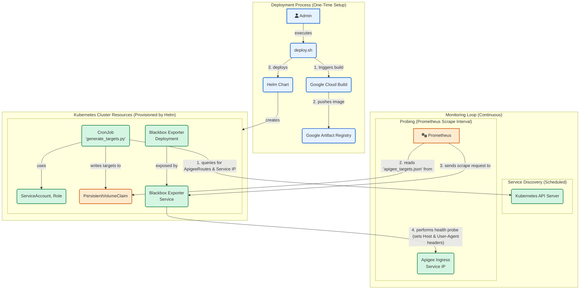

# Apigee Hybrid Health Check Exporter for Prometheus

This solution provides a complete, automated way to discover and monitor the health of all API proxies deployed in an Apigee Hybrid environment using Prometheus and the Blackbox Exporter.

It uses a Kubernetes-native approach to dynamically discover API proxy basepaths and hostnames, generates a target file, and deploys the necessary components to enable robust health-check monitoring without manual configuration.


## Architecture
The monitoring workflow consists of several components working together:
- **Kubernetes CronJob:** Runs a Python script on a schedule. This script connects to the Kubernetes API to discover all ApigeeRoute resources.
- **Service Discovery:** The script parses the resources to find all externally-facing hostnames and API proxy basepaths. It also fetches the ClusterIP of the Apigee ingress service to enable probing without DNS.
- **Persistent Volume Claim (PVC): The CronJob writes the discovered URLs into a apigee_targets.json file on a shared PVC. This file is formatted for Prometheus's file-based service discovery.
- **Blackbox Exporter:** A standard Prometheus exporter that is deployed by the Helm chart. Its job is to perform the actual health probes against the targets.
- **Prometheus:** Your existing Prometheus instance is configured to read the apigee_targets.json file from the PVC. For each target, it scrapes the Blackbox Exporter, which then sends the specialized health check probe (/healthz/... with User-Agent: GoogleHC) to the Apigee ingress.

Here is a diagram that visually represents the architecture of the solution. 




## Prerequisites

Before you begin, ensure you have the following tools installed and configured:
- gcloud CLI (authenticated to your Google Cloud account)
- helm (v3+)
- kubectl (configured to access your Kubernetes cluster where Apigee Hybrid is running)
- docker client
- Permissions in your GCP project to use Cloud Build and Artifact Registry.
A running Prometheus instance in your cluster.

## Installation

The deployment is managed by a single bash script that automates the entire process.


### Step 1: Clone the Repository
Clone this repository to your local machine. All commands should be run from the root of the repository.


### Step 2: Configure the Deployment

The script uses a configuration file named config.ini to manage all user-specific settings.

1. Create a `config.ini` file. A template is provided in config.ini.example.
```bash
cp config.ini.example config.ini
```

2. Edit `config.ini` and provide values for the following keys:

```ini
[gcp]
project_id = your-gcp-project-id
region = us-central1
artifact_registry_name = apigee-monitoring-repo

[helm]
# Find this with 'kubectl get svc -n apigee'
apigee_ingress_service = your-apigee-ingress-svc-name
```

### Step 3: Run the Deployment Script

The `deploy.sh` script automates the Docker build, push to Artifact Registry, and Helm chart deployment.

1. Make the script executable:

```bash
chmod +x deploy.sh
```

2. Run the script:

```bash
bash ./deploy.sh
```

The script will handle the rest. Upon completion, it will have deployed the Blackbox Exporter, the PVC, and the discovery CronJob into your cluster.


## Prometheus Integration

This chart does not modify your Prometheus configuration directly. You must manually configure your Prometheus instance to discover and scrape the new targets.

If you are using the popular [prometheus-community/prometheus](https://www.google.com/url?sa=E&q=https%3A%2F%2Fgithub.com%2Fprometheus-community%2Fhelm-charts%2Ftree%2Fmain%2Fcharts%2Fprometheus) Helm chart, you can add the following to your Prometheus values.yaml:

```yaml

# In your Prometheus values.yaml

# 1. Add the volume to access the PVC created by our chart.
# The claimName is based on the Helm release name (e.g., 'apigee-monitor').
extraVolumes:
  - name: apigee-targets
    persistentVolumeClaim:
      claimName: apigee-monitor-prometheus-apigee-exporter-pvc

# 2. Mount the volume into the Prometheus container.
extraVolumeMounts:
  - name: apigee-targets
    mountPath: /etc/prometheus-targets # This path must match file_sd_configs path below
    readOnly: true

# 3. Add the scrape configuration to discover and probe the targets.
extraScrapeConfigs: |
  - job_name: 'apigee-health-blackbox'
    metrics_path: /probe
    params:
      module: ['http_2xx'] # Must match 'moduleName' in this chart's values.yaml
    file_sd_configs:
      - files:
        - '/etc/prometheus-targets/apigee_targets.json'
    relabel_configs:
      # Use the URL from the file as the 'target' parameter for the Blackbox probe
      - source_labels: [__address__]
        target_label: __param_target
      # Use the 'apigee_hostname' label from the file to set the 'Host' HTTP header
      - source_labels: [apigee_hostname]
        target_label: __param_http_header_Host
      # The actual address to scrape is the Blackbox Exporter's service
      # The service name is based on the Helm release name (e.g., 'apigee-monitor')
      - source_labels: []
        target_label: __address__
        replacement: 'apigee-monitor-prometheus-apigee-exporter-blackbox.monitoring.svc:9115'

```


After updating your Prometheus values, apply the changes with helm upgrade.


## Helm Chart Configuration
You can customize the Helm deployment by modifying the values.yaml file or by using --set flags during installation.


Parameter|Description|Default|
| -------- | ------- |------- |
blackboxExporter.image.repository|Blackbox Exporter Docker image repository.|prom/blackbox-exporter|
blackboxExporter.image.tag|Blackbox Exporter Docker image tag.|v0.24.0|
blackboxExporter.config.insecureSkipVerify|Skip TLS certificate verification during probes.|true|
blackboxExporter.config.moduleName|The name of the Blackbox Exporter module to configure.|http_2xx|
cronjob.enabled|If true, deploy the discovery CronJob.|true|
cronjob.schedule|Cron schedule for running the discovery script.|"*/15 * * * *"|
cronjob.image.repository|Repository of the Python discovery script image (set by deploy.sh).|your-registry/apigee-target-generator|
cronjob.apigeeNamespace|Kubernetes namespace where Apigee Hybrid is installed.|"apigee"|
cronjob.apigeeIngressService|Name of the Apigee ingress K8s service (set by deploy.sh).|"apigee-ingressgateway"|
persistence.enabled|If true, create a PVC to store the target file.|true|
persistence.size|Size of the PVC.|1Gi|
targetFilePath|The path inside the pods where the target file is stored.|"/etc/prometheus-targets/apigee_targets.json"|
serviceAccount.create|If true, create a ServiceAccount with RBAC for the CronJob.|true|


## Project Structure

```
.
├── Chart.yaml                  # Helm chart metadata
├── config.ini.example          # Template for user configuration
├── deploy.sh                   # Main deployment script
├── .gitignore
├── python-script/
│   ├── Dockerfile              # Dockerfile for the Python script
│   ├── .dockerignore
│   ├── generate_targets.py     # The Python discovery script
│   └── requirements.txt
├── templates/                  # Helm chart templates
│   ├── _helpers.tpl
│   ├── blackbox-configmap.yaml
│   └── (other templates...)
└── values.yaml                 # Default values for the Helm chart
```

## Cleanup

To remove all the components deployed by this chart, use the helm uninstall command with the release name you specified in config.ini.


```bash
helm uninstall apigee-monitor --namespace monitoring
```

This will delete the CronJob, Blackbox Exporter deployment, Service, PVC, and RBAC resources. You will need to manually remove the scrape configuration from your Prometheus instance.